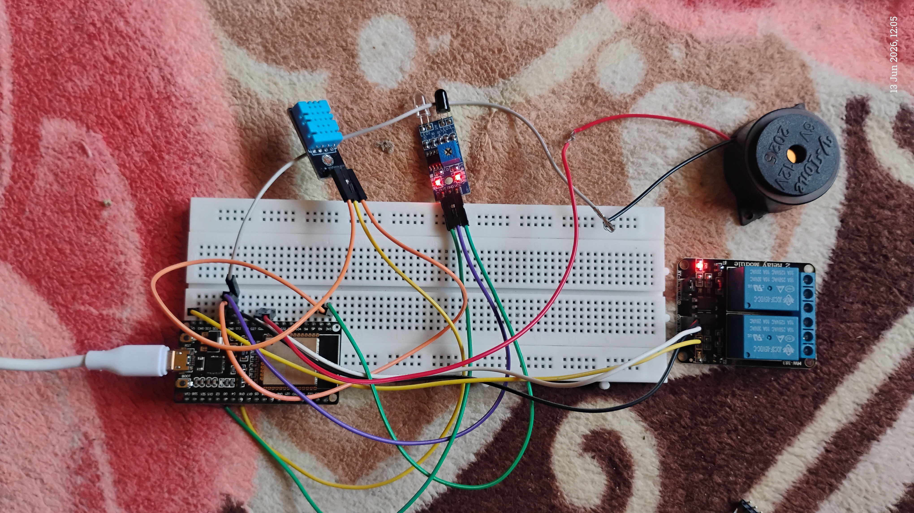
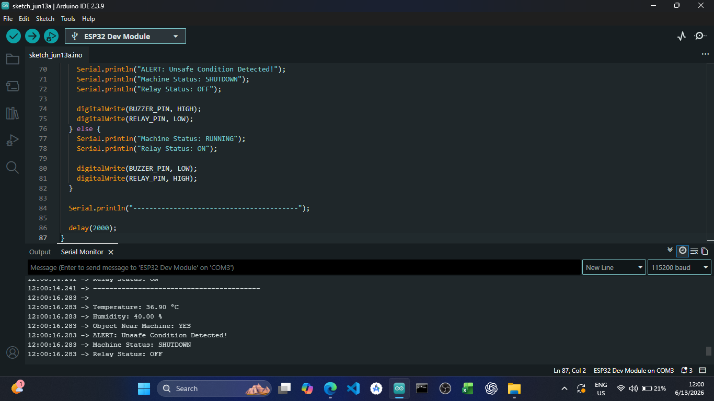

# ESP32 Smart Machine Health Monitor

## Overview

This project is a practical ESP32-based Smart Machine Health Monitor and Safety Monitoring System.

The system monitors machine-area safety conditions using a DHT11 temperature and humidity sensor, an IR obstacle sensor, a buzzer, and a relay module. If an unsafe condition is detected, such as a person/object near the machine or high temperature, the system activates a buzzer alert and simulates emergency machine shutdown using a relay.

This project demonstrates embedded firmware development, sensor interfacing, real-time monitoring, and safety-control logic using ESP32.

---

## Features

- Real-time temperature monitoring
- Real-time humidity monitoring
- IR-based object/person detection near machine area
- Buzzer alert during unsafe conditions
- Relay-based emergency shutdown simulation
- Serial Monitor output for live system status
- ESP32-based embedded firmware implementation
- Practical breadboard-based hardware prototype

---

## Hardware Used

- ESP32 Development Board
- DHT11 Temperature and Humidity Sensor
- IR Obstacle Detection Sensor
- Active Buzzer
- Relay Module
- Breadboard
- Jumper Wires

---

## Software Used

- Arduino IDE
- Embedded C/C++
- ESP32 Arduino Core
- DHT Sensor Library by Adafruit
- Adafruit Unified Sensor Library

---

## Pin Connections

### DHT11 Sensor

| DHT11 Pin | ESP32 Pin |
|---|---|
| VCC | 3.3V |
| GND | GND |
| DATA | GPIO 4 |

### IR Sensor

| IR Sensor Pin | ESP32 Pin |
|---|---|
| VCC | 3.3V |
| GND | GND |
| OUT | GPIO 15 |

### Buzzer

| Buzzer Pin | ESP32 Pin |
|---|---|
| Positive | GPIO 25 |
| Negative | GND |

### Relay Module

| Relay Pin | ESP32 Pin |
|---|---|
| VCC | VIN / 5V |
| GND | GND |
| IN | GPIO 26 |

---

## Working Logic

1. ESP32 continuously reads temperature and humidity values from the DHT11 sensor.
2. ESP32 also monitors the IR sensor output to detect whether a person/object is near the machine area.
3. If temperature crosses the threshold limit, the system marks it as an unsafe condition.
4. If the IR sensor detects an object/person near the machine, the system marks it as an unsafe condition.
5. During unsafe condition:
   - Buzzer turns ON
   - Relay turns OFF
   - Machine status changes to SHUTDOWN
6. During safe condition:
   - Buzzer remains OFF
   - Relay remains ON
   - Machine status remains RUNNING

---

## Safety Conditions

| Condition | System Response |
|---|---|
| Normal temperature + no object detected | Machine RUNNING |
| Object/person detected near machine | Machine SHUTDOWN |
| High temperature detected | Machine SHUTDOWN |
| Unsafe condition detected | Buzzer ON + Relay OFF |

---

## Source Code

| File | Description |
|---|---|
| `machine_safety_monitor.ino` | ESP32 firmware code for DHT11, IR sensor, buzzer, and relay-based safety monitoring |

---

## Practical Output

```text
Temperature: 36.90 °C
Humidity: 40.00 %
Object Near Machine: YES
ALERT: Unsafe Condition Detected!
Machine Status: SHUTDOWN
Relay Status: OFF

## Demo Images

### Hardware Setup


### Serial Monitor Alert Output


## Project Status

Practical hardware prototype completed using ESP32, DHT11 sensor, IR sensor, buzzer, and relay module.

MPU6050 vibration monitoring was planned in the initial concept and will be added in a future version.
